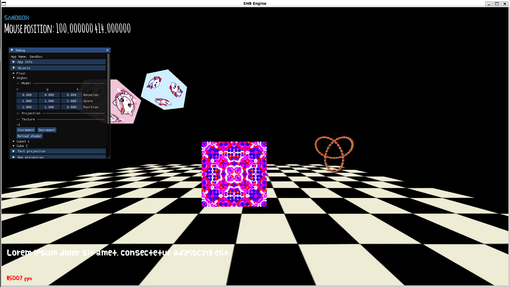
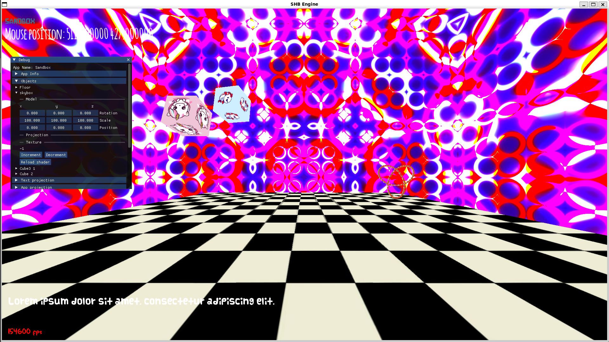
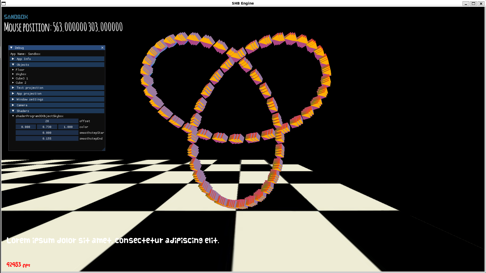

## To get running in linux/WSL:
1. Clone the repository
2. run `./configure.sh`
3. run `./build.sh` OR `./build_run.sh`

## To get running in native Windows:
WIP

## Features

### - Textures and fonts.
All textures added to the `resources/textures` folder that are in .jpg format will be automatically scraped and added to the engine. 
All fonts added to the `resources/fonts` folder that are in .ttf format will also be scraped and added to the engine.
  

### - Camera system.
Have multiple cameras save their location in world space for a *cinematic* (technically not wrong) experience (soon to be implemented are follow cameras, third person cameras, 
perhaps even **hyperbolic** cameras)
  

### - Real Time shader editing and reload. 
Write your shader code in your shader file associated with the particular object, click the "Reload shader" button and it will be updated without having to restart the application. 
  
  

### - Extremely jarring skybox!

  

  

### - Trefoil knot.
Everyone loves a trefoil knot
  
  

**This is a work in progress.** I intend to make the architecture of this code much more efficient and intuitive in the coming months. I also intend to add a section
for listing controls but I have not decided on a final layout for them as of yet. 
  
## Todo Wishlist:
- Windows build method.  
- json support.  
- Scripting support (lua or custom .txt config files).  
- Game object serialisation.  
- System for parsing graphing functions into drawing lines at a particular position. e.g. the trefoil knot.  

